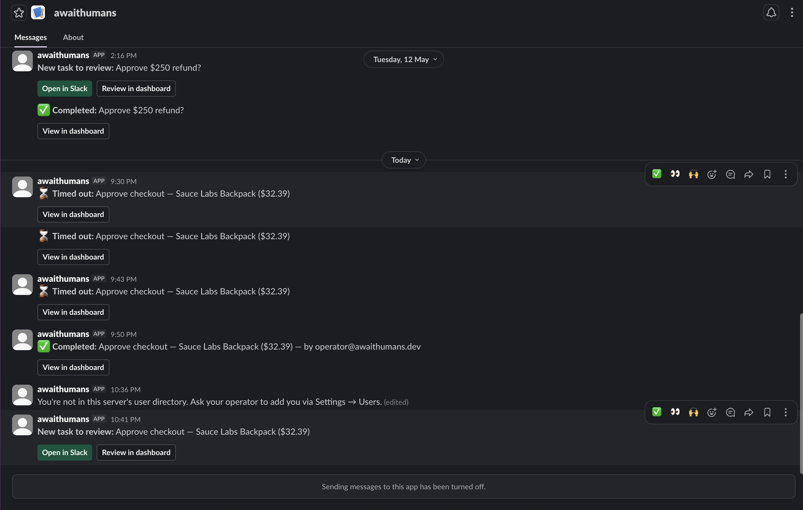
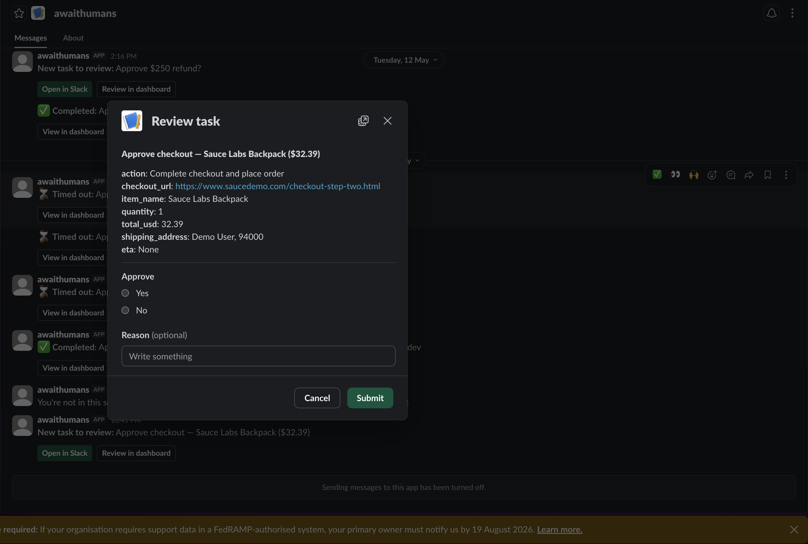
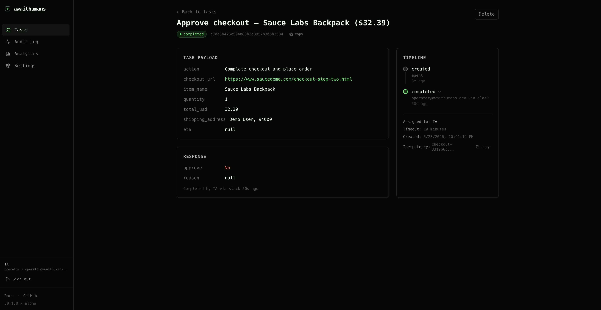

# 🛒 Browser agent that asks before it buys

A template repo: **[browser-use](https://github.com/browser-use/browser-use) + [awaithumans](https://github.com/awaithumans/awaithumans) in ~90 lines.**

Your AI agent navigates a real web page, fills the cart, reaches the order-review screen — and then **stops to ask a human**. Slack DM or email. Tap Approve, and the agent resumes and clicks **Place order**. Tap Reject and it stops.

[](https://github.com/awaithumans/awaithumans)
[](LICENSE)
[](https://www.python.org/downloads/)

---

> "Trained to ask approval before finalizing any significant action, such as submitting an order."
> — [OpenAI Operator design guideline](https://openai.com/index/introducing-operator/)

Operator forces this. OSS browser-agent frameworks don't ship the primitive — there are open feature requests for it across [browser-use #221](https://github.com/browser-use/browser-use/issues/221), [browser-use #3341](https://github.com/browser-use/browser-use/issues/3341), and [browser-use #4798](https://github.com/browser-use/browser-use/issues/4798).

**This repo is the missing primitive, plugged in.**

---

## 📸 What you'll see when it works

| 1. Slack DM (the notification) | 2. Slack modal (review in Slack) | 3. Dashboard (web fallback) |
|---|---|---|
|  |  |  |
| Agent reaches checkout → pings you in Slack with cart details + buttons | Click **Open in Slack** → Block Kit modal with the typed payload + Approve/Reject form. **No tab switch.** | Or click **Review in dashboard** → web form. Useful if your operators don't live in Slack. |

The agent waits for your tap, then resumes and clicks **Place order**.

---

## ⚡ Quick start (~10 minutes from a clean machine)

```bash
# 1. Clone
git clone https://github.com/awaithumans/awaithumans-browser-agent
cd awaithumans-browser-agent

# 2. Configure
cp .env.example .env
# Edit .env — see "What to set" below.

# 3. Generate the encryption key (REQUIRED — see .env.example)
python3 -c "import secrets; print('AWAITHUMANS_PAYLOAD_KEY=' + secrets.token_urlsafe(32))" >> .env

# 4. Touch the discovery file (host bind-mount needs it to exist as a file)
touch ~/.awaithumans-dev.json

# 5. Start the awaithumans server in the background
docker compose up -d awaithumans

# 6. Wait ~15s, then open the first-run setup URL printed in the logs
docker compose logs awaithumans | grep -A 3 "First-run setup"
# Click the http://localhost:3001/setup?token=... link → create your operator account

# 7. Install Python deps + the Chromium browser-use needs
uv pip install -e .   # (or: pip install -e .)
playwright install chromium

# 8. Run the demo
python buy_usb_hub.py
```

Within 60-90 seconds you'll see a Slack DM (or email) asking for approval. Tap Approve. Watch your terminal — the agent unblocks and finishes the order.

### What to set in `.env`

The bare minimum to make the demo work:

```bash
AWAITHUMANS_DEMO_CHANNEL=slack                    # or "email"
ANTHROPIC_API_KEY=sk-ant-...                      # OR OPENAI_API_KEY
DEMO_OPERATOR_EMAIL=you@yourcompany.com           # email you'll register at /setup

# Slack route — only needed if AWAITHUMANS_DEMO_CHANNEL=slack
AWAITHUMANS_SLACK_BOT_TOKEN=xoxb-...
AWAITHUMANS_SLACK_SIGNING_SECRET=...
DEMO_SLACK_NOTIFY_ID=U01234567                    # your Slack user ID
```

Everything else in `.env.example` is optional. The file is heavily commented — read top-to-bottom once.

> **Want the `Open in Slack` button to actually open a modal?** Slack's cloud servers can't reach `http://localhost:3001`. See **Slack interactivity** below.

---

## 🧠 How it works

Three moving parts:

```
┌──────────────────┐       request_human_approval(...)        ┌─────────────────────┐
│ browser-use      │ ───────────────────────────────────────► │ awaithumans server  │
│ Agent (your LLM) │                                          │  - Pydantic typed   │
│                  │ ◄─── ActionResult(extracted_content=...) │  - Pluggable channel│
│ Has a custom     │       "HUMAN APPROVED" / "HUMAN REJECTED"│  - Audit trail      │
│ Tool that calls  │                                          │  - Built-in UI      │
│ await_human()    │                                          └──────────┬──────────┘
└──────────────────┘                                                     │
                                                                         │ Slack / email
                                                                         ▼
                                                                ┌────────────────┐
                                                                │  You, on phone │
                                                                │   ✅ Approve   │
                                                                │   ❌ Reject    │
                                                                └────────────────┘
```

The agent's LLM is given a system instruction: *"Before any irreversible action — checkout, submit, send — call `request_human_approval` first."* The custom tool wraps `await_human()`, which:

- **Persists the task** to a typed database row (so it survives worker restarts)
- **Routes the payload** to your chosen channel (Slack DM with screenshot card, or email magic-link)
- **Waits** up to `timeout_seconds` for a typed response
- **Optionally pre-screens** via a Claude verifier (auto-approve if cart total is under budget)
- **Returns a typed Pydantic `Decision`** (`approve: bool, reason: str | None`) back to the agent

The agent reads the decision via `ActionResult.extracted_content` and either submits or stops.

---

## 📁 What's in this repo

```
.
├── buy_usb_hub.py          ← Main demo (~100 lines) — agent buys a Sauce Labs Backpack
├── job_application.py      ← Secondary demo: agent drafts an application, you approve the submit
├── docker-compose.yml      ← Bring-up for the awaithumans server (mounts discovery file to host)
├── .env.example            ← Annotated env template
├── pyproject.toml          ← Python deps (browser-use, awaithumans, pydantic)
└── docs/images/            ← Hero screenshots
```

The checkout demo points at **[saucedemo.com](https://www.saucedemo.com)** — the testing community's canonical practice site. Public, free, credentials are intentionally publishable (`standard_user` / `secret_sauce`), no real money moves, no CAPTCHA. The same site the Selenium/Playwright community uses for everyday automation demos.

### Why two examples?

The buy-USB-hub demo is the canonical case — every browser-agent framework markets purchasing as a top use case. The job-application demo is intentional: **[OpenAI Operator explicitly refuses](https://openai.com/index/introducing-operator/) high-stakes decisions like job applications.** OSS users have no choice but to add HITL. This repo shows how, in 30 extra lines.

---

## 🛠 Extending it

Add your own approval-gated action. Define a Pydantic payload, register a `@tools.action`, call `await_human()`:

```python
from awaithumans import await_human
from browser_use import ActionResult, Tools
from pydantic import BaseModel

class TransferApproval(BaseModel):
    from_account: str
    to_account: str
    amount_usd: float
    memo: str

class Decision(BaseModel):
    approve: bool
    reason: str | None = None

tools = Tools()

@tools.action(description="REQUIRED before any wire transfer. Asks a human.")
async def request_transfer_approval(
    from_account: str, to_account: str, amount_usd: float, memo: str
) -> ActionResult:
    decision: Decision = await await_human(
        task=f"Approve transfer — ${amount_usd:.2f} to {to_account}",
        payload_schema=TransferApproval,
        payload=TransferApproval(from_account=from_account, to_account=to_account, amount_usd=amount_usd, memo=memo),
        response_schema=Decision,
        assign_to="your-operator@example.com",
        notify=["slack:U01234567"],
        timeout_seconds=900,
    )
    return ActionResult(
        extracted_content="APPROVED" if decision.approve else f"REJECTED: {decision.reason}"
    )
```

Same shape works for any risky action: deploy, delete, send, post, suspend, refund, withdraw.

**Footguns to avoid** (each cost real time during this template's build-out):

- **Don't name a parameter `page_url`** — browser-use injects that automatically. Use `target_url` / `checkout_url` instead.
- **Always pass `payload_schema=`** — required by `await_human()`, not auto-derived from `payload`.
- **Set `idempotency_key=` per agent run.** Without it the SDK derives a key from the payload hash; identical reruns hit the server's cache and return the previous run's response instantly. The demos generate a per-process `RUN_ID` for this.
- **Use a capable model.** `claude-haiku-4-5` / `gpt-4o-mini` intermittently malform custom-tool calls — the action JSON ends up in the `thinking` field instead of `action`. Sonnet / gpt-4o are reliable.

---

## 📡 Slack interactivity (clickable buttons in Slack itself)

By default, clicking **Open in Slack** on the notification card fails because Slack's cloud servers can't reach `http://localhost:3001`. The notification ITSELF is sent (your server → Slack → you), but the button-click round-trip (Slack → your server) needs a public URL.

Easiest fix: [ngrok](https://ngrok.com/). 5 minutes total.

```bash
# In a separate terminal:
ngrok http 3001
# → Forwarding https://yourname.ngrok-free.app -> http://localhost:3001
```

Then:

1. Add to `.env`: `AWAITHUMANS_PUBLIC_URL=https://yourname.ngrok-free.app`
2. `docker compose restart awaithumans` (picks up the new public URL)
3. In your Slack app config (https://api.slack.com/apps → your app):
   - **Interactivity & Shortcuts** → enable → Request URL: `https://yourname.ngrok-free.app/api/channels/slack/interactions`
   - Save

Click **Open in Slack** on a fresh approval card. The Block Kit modal opens directly inside Slack (screenshot #2 above).

> **First click might fail with "you're not in the user directory"** — that's resolved on `:v0.1.7+` of the awaithumans image (which auto-links your Slack identity to your operator account by email on first click). If you're on an older image, manually paste your Slack user ID into the dashboard's Settings → Users.

---

## 🔍 What awaithumans gives you over a hand-rolled Slack bot

This repo would be ~300 lines if you built the HITL layer yourself. With awaithumans it's ~100:

- ✅ **Durable** — pending awaits survive worker restarts (Stripe-style idempotency keys)
- ✅ **Typed** — Pydantic on the way in, Pydantic on the way out — no string parsing
- ✅ **Multi-channel** — Slack, email, web dashboard, all from one config
- ✅ **Audit trail** — who approved what, when, from which channel
- ✅ **AI verifier (optional)** — Claude pre-screens trivial cases so the human only sees the hard ones
- ✅ **Resumable** — kill the worker mid-await, restart, agent resumes from the exact pause

Full SDK docs: **[docs.awaithumans.dev](https://docs.awaithumans.dev)**

---

## 🤝 Related

- **[awaithumans](https://github.com/awaithumans/awaithumans)** — the HITL primitive itself (Python + TypeScript SDKs, Apache 2.0)
- **[browser-use](https://github.com/browser-use/browser-use)** — the browser-automation framework this demo is built on (MIT)
- **[Skyvern](https://github.com/Skyvern-AI/skyvern)** — alternative browser agent; same `Tools`-style integration would work
- **[Stagehand](https://github.com/browserbase/stagehand)** — TypeScript-native option (a TS version of this template is on the roadmap)

---

## 📜 License

MIT. Use it, fork it, ship it.

---

## 🗺 Roadmap

- [ ] **Prediction-market demo** — agent that picks Manifold Markets positions, asks human to approve each bet. Likely the highest-leverage shareable variant (AI + markets + HITL).
- [ ] **Job-application demo, polished** — `job_application.py` exists but points at a placeholder URL. Target a safe Greenhouse demo board with a realistic application flow. Operator explicitly refuses this category, so it's a direct gap awaithumans fills.
- [ ] **Telegram channel** — coming in awaithumans Week 3 release (mobile-first operators)
- [ ] **TypeScript version using Stagehand** — same demo, TS-native stack
- [ ] **WhatsApp channel** (via Twilio bridge) — for personal-agent use cases
- [ ] **Companion demos**: AI deploy approver (CI/CD gate), AI content moderator (suspend / restore), AI travel booker (book flights, ask before checkout)

Have an idea? [Open an issue](https://github.com/awaithumans/awaithumans-browser-agent/issues) or DM [@awaithumans](https://x.com/awaithumans) on X.
